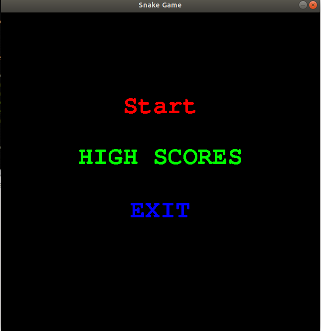
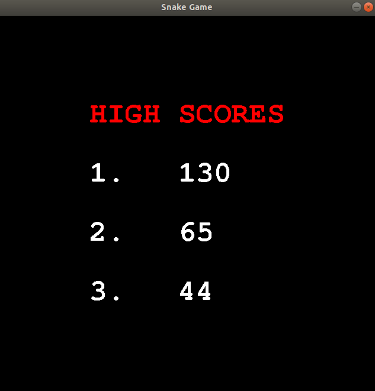
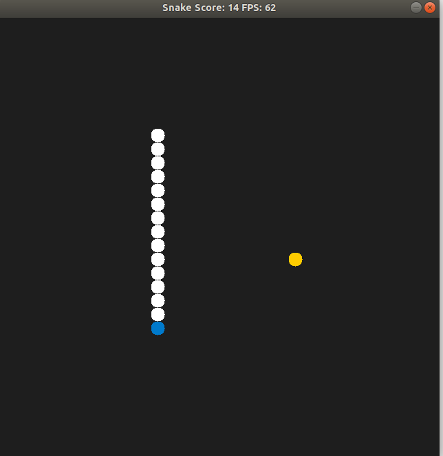
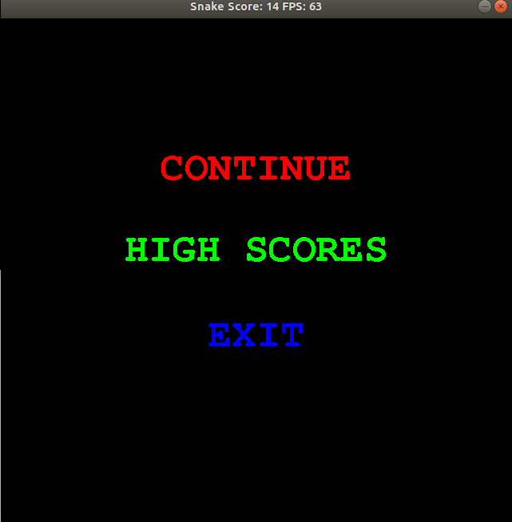

# CPPND: Capstone Snake Game Example

This project extends C++ Nanodegree Capstone project called Snake game

Game working:
1. launch the executabele (after sucessfully build) : you will be tajen to the main menu with three options 
 
 	
2. Hover the cursor over the options to see the selectable option and select any option. Depending on what you choose you will be taken to the next window.

	

	
3. you can move back from a window by using escape key.To pause the game use escape key. click on continue to continue
	

Project meets the following rubric points:
* The project compiles and run.
* The project demonstrates an understanding of C++ functions and control structures.
	  multiple functions are created and used throughout the project.
		eg.  int renderer.h and renderer.cpp files
		     int RenderStartMenu(std::string str);
  		     int RenderHighScores();
		     void DrawCircle(SDL_Renderer * renderer, int centreX, int centreY, int radius);
		     void setScores(int one,int two,int three)
		     
* The project reads data from a font file and process the data.
	  eg. In file main.cpp file input output operations are performed.
        data read write operations are performed from file. The game keeps tracks of high scores 
	      these scores are stored in a text file and are being updated based on new games played.

* The project accepts user input in the form of directions and processes the input to move the snake.
    eg. the project takes  user input in multiple forms, as key pressed to move the snake.
        mouse movement input to select the menu options
        mouse click input to select the menu options

* The project uses Object Oriented Programming techniques.
        this is clearly evedent in all files.

* Classes use appropriate access specifiers for class members.
        class members are used with setter methods to put in value

* Class constructors utilize member initialization lists.

* The project makes use of references in function declarations.

* The project uses destructors appropriately.

## Dependencies for Running Locally
* cmake >= 3.7
  * All OSes: [click here for installation instructions](https://cmake.org/install/)
* make >= 4.1 (Linux, Mac), 3.81 (Windows)
  * Linux: make is installed by default on most Linux distros
  * Mac: [install Xcode command line tools to get make](https://developer.apple.com/xcode/features/)
  * Windows: [Click here for installation instructions](http://gnuwin32.sourceforge.net/packages/make.htm)
* SDL2 >= 2.0
  * All installation instructions can be found [here](https://wiki.libsdl.org/Installation)
  * Note that for Linux, an `apt` or `apt-get` installation is preferred to building from source.
    * sudo apt install libsdl2-dev
    * sudo apt-get install libsdl2-dev
* SDL2 TTF >= 2.0
  * All installation instructions can be found [here](https://www.libsdl.org/projects/SDL_ttf/docs/SDL_ttf.html)
  * Note that for Linux, an `apt` or `apt-get` installation is preferred to building from source.
    * sudo apt install libsdl2-ttf-dev
    * sudo apt-get install libsdl2-ttf-dev
* gcc/g++ >= 5.4
  * Linux: gcc / g++ is installed by default on most Linux distros
  * Mac: same deal as make - [install Xcode command line tools](https://developer.apple.com/xcode/features/)
  * Windows: recommend using [MinGW](http://www.mingw.org/)

## Basic Build Instructions

1. Clone this repo.
2. Make a build directory in the top level directory: `mkdir build && cd build`
3. Compile: `cmake .. && make`
4. Run it: `./SnakeGame`.

## CC Attribution-ShareAlike 4.0 International

Shield: [![CC BY-SA 4.0][cc-by-sa-shield]][cc-by-sa]

This work is licensed under a
[Creative Commons Attribution-ShareAlike 4.0 International License][cc-by-sa].

[![CC BY-SA 4.0][cc-by-sa-image]][cc-by-sa]

[cc-by-sa]: http://creativecommons.org/licenses/by-sa/4.0/
[cc-by-sa-image]: https://licensebuttons.net/l/by-sa/4.0/88x31.png
[cc-by-sa-shield]: https://img.shields.io/badge/License-CC%20BY--SA%204.0-lightgrey.svg
